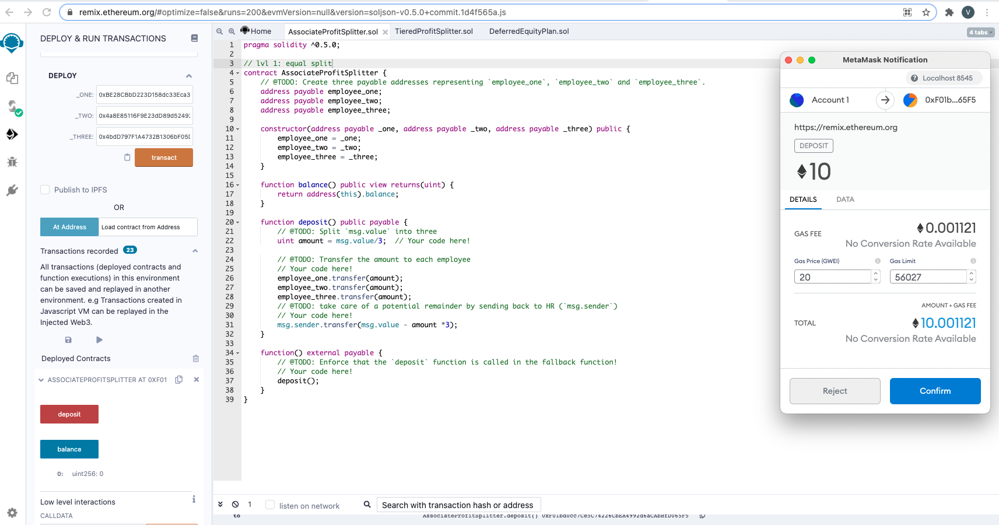
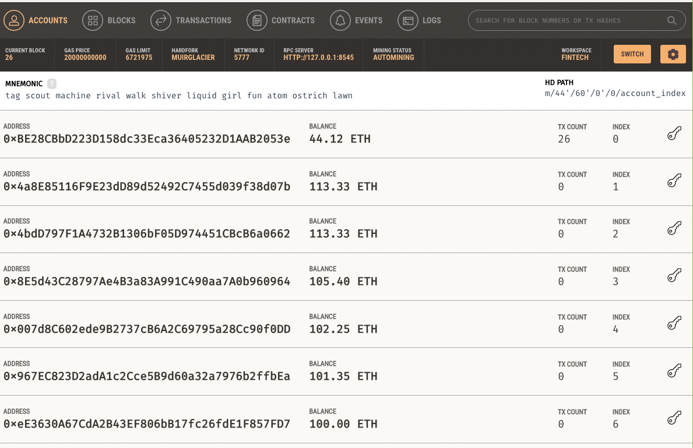
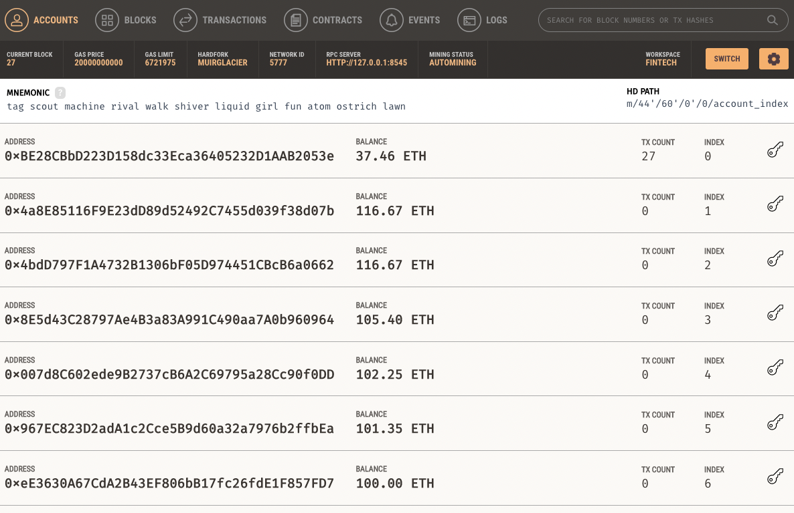
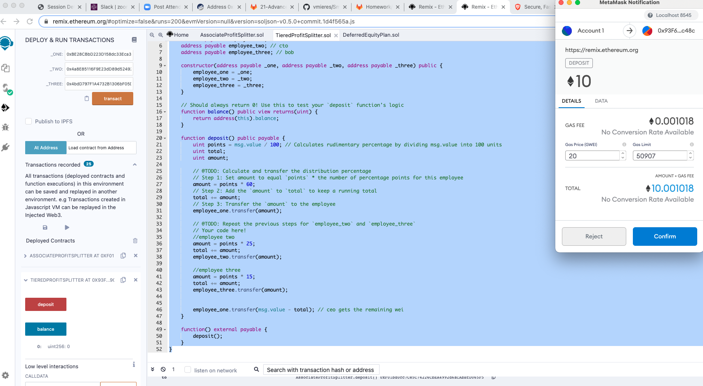
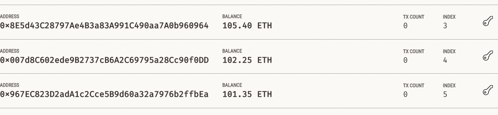
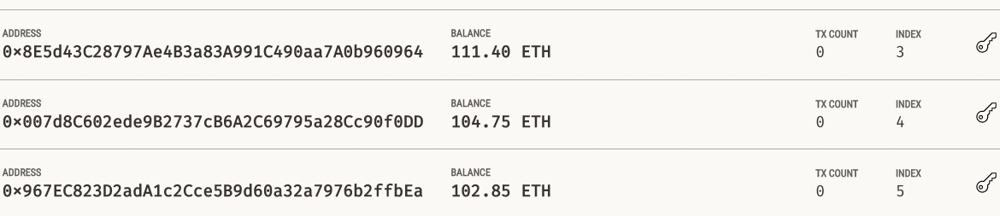
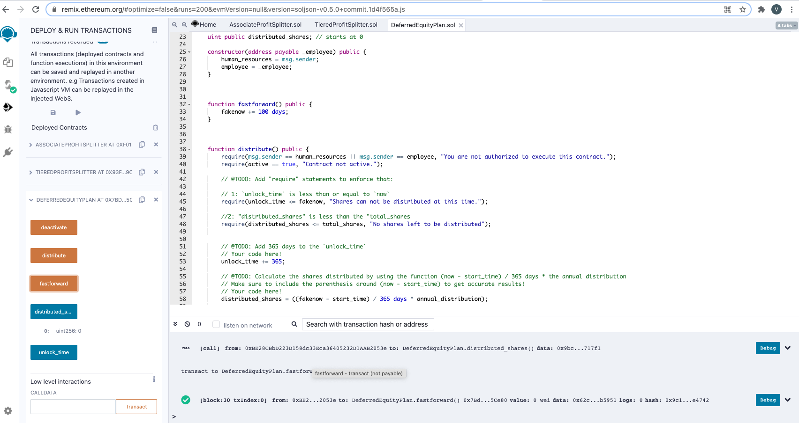
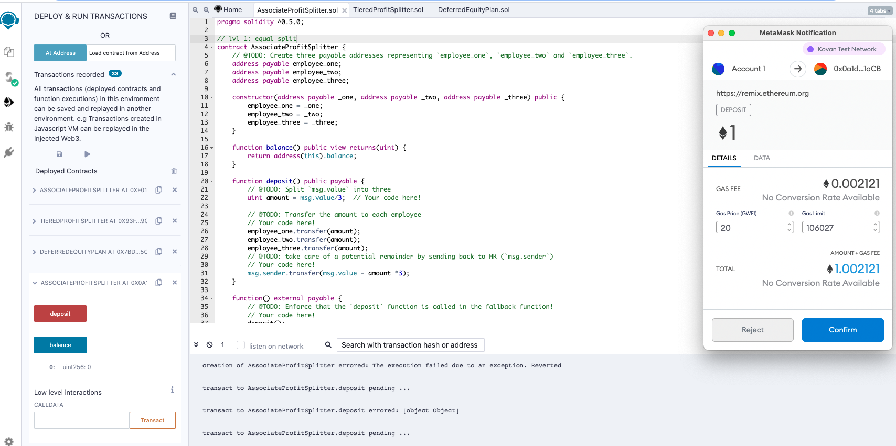

# **Smart Contracts with Solidity**

This repo is about building smart contracts to automate some company finances to make everyone's lives easier, increase transparency, and to make accounting and auditing practically automatic! To streamline the operation.
These ProfitSplitter contracts will:

-  Pay your Associate-level employees quickly and easily.
- Distribute profits to different tiers of employees.
-Distribute company shares for employees in a "deferred equity incentive plan" automatically.

## **Instructions**
This assignment has 3 levels of difficulty, with each contract increasing in complexity and capability. 

- *Level One* is an AssociateProfitSplitter contract. This accepts Ether into the contract and divide the Ether evenly among the associate level employees. This will allow the Human Resources department to pay employees quickly and efficiently.

- *Level Two* is a TieredProfitSplitter that will distribute different percentages of incoming Ether to employees at different tiers/levels. For example, the CEO gets paid 60%, CTO 25%, and Bob gets 15%.

- *Level Three* is a DeferredEquityPlan that models traditional company stock plans. This contract will automatically manage 1000 shares with an annual distribution of 250 over 4 years for a single employee.

## **Starting the project:**
Using Remix IDE to create a new contract called 

AssociateProfitSplitter.sol 

While developing and testing contract, I used the Ganache development chain, and point MetaMask to localhost:8545, or replace the port with what I have set on workspace.

**Level One:** 

The AssociateProfitSplitter Contract

In the Deploy tab in Remix, I deployed the contract to my local Ganache chain addresses by connecting to Injected Web3 and ensuring MetaMask is pointed to localhost:8545.

In the constructor parameters I designated the employee addresses.

Because I used the same account to be debited and the first account to be credited, in the first address we can see the sum of 37.46 from 44.12. After sending 10 ETH equally distributed to the first 3 adressess. 

**Level Two**:

Tiered ProfitSplitter Contract.

Here, rather than splitting the profits between Associate-level employees, we calculate rudimentary percentages for different tiers of employees (CEO, CTO, and Bob).

For the level two contract I used the split 60, 25 and 15 percent for the accounts. 

So after transferring 10 ether we have:

**Level Three**

The DeferredEquity Plan

In this contract, we will be managing an employee's "deferred equity incentive plan" in which 1000 shares will be distributed over 4 years to the employee. We won't need to work with Ether in this contract, but we will be storing and setting amounts that represent the number of distributed shares the employee owns and enforcing the vetting periods automatically.

- A two-minute primer on deferred equity incentive plans: In this set-up, employees receive shares for joining and staying with the firm. They may receive, for example, an award of 1,000 shares when joining, but with a 4 year vesting period for these shares. This means that these shares would stay with the company, with only 250 shares (1,000/4) actually distributed to and owned by the employee each year. If the employee leaves within the first 4 years, he or she would forfeit ownership of any remaining (“unvested”) shares.

  - If, for example, the employee only sticks around for the first two years before moving on, the employee’s account will end up with 500 shares (250 shares * 2 years), with the remaining 500 shares staying with the company. In this above example, only half of the shares (and any distributions of company profit associated with them) actually “vested”, or became fully owned by the employee. The remaining half, which were still “deferred” or “unvested”, ended up fully owned by the company since the employee left midway through the incentive/vesting period.

  - Specific vesting periods, the dollar/crypto value of shares awarded, and the percentage equity stake (the percentage ownership of the company) all tend to vary according to the company, the specialized skills, or seniority of the employee, and the negotiating positions of the employee/company. If you receive an offer from a company offering equity (which is great!), just make sure you can clarify the current dollar value of those shares being offered (based on, perhaps, valuation implied by the most recent outside funding round). In other words, don’t be content with just receiving “X” number of shares without having a credible sense of what amount of dollars that “X” number represents. Be sure to understand your vesting schedule as well, particularly if you think you may not stick around for an extended period of time.
  

**Deploy the contracts to a live Testnet - Ropsten network**

I switched my MetaMask to the Ropsten network. I had 5 test Ether on this network!

After switching MetaMask to Ropsten network, deploy the contracts as before and copy/keep a note of their deployed addresses. The transactions will also be in your MetaMask history, and on the blockchain permanently to explore later.

**contract_1 address**
0x0a1d6c8b9e364eb1c1ed79d4d0f671dc6e651acb
 
**contract_2 address**
0xe44f3592c3143aa0163a960a678ff378ac3d1b12
 
**contract_3_address**
0x7bd6dcd322d506a6ce2ad62268bb6bf59985ce80

### **Resources**
- Tutorial [EthereumDev.io](https://ethereumdev.io/)
- Code snips [Solidity by example](https://github.com/raineorshine/solidity-by-example)
- Building games [CryptoZombies](https://cryptozombies.io/
)

